Desenvolvendo uma análise em Estatística Espacial
========================================================
author: Gabriel Sartori Klostermann
date: 13/03/2018
autosize: true
<!-- transition: rotate -->


Sumário
========================================================
- Classes em Estatística Espacial
  - Processo Pontual
  - Geoestatística
  - Dados de Área
- Aplicação em Dados de Área 
  
Classes em Estatística Espacial
========================================================

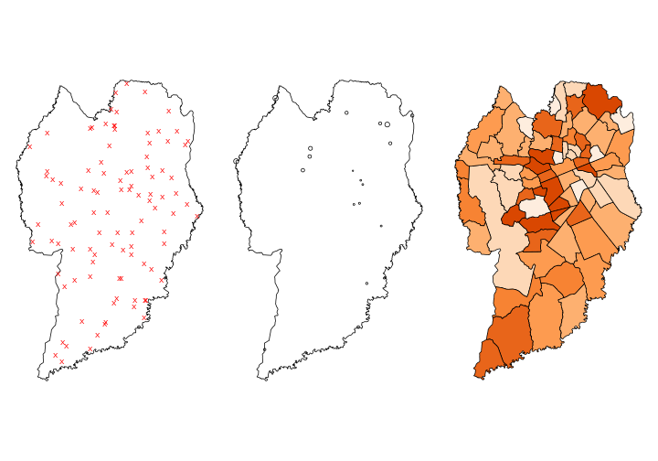

Dengue 
========================================================


Processo Pontual 
========================================================
- Ocorrência de dengue

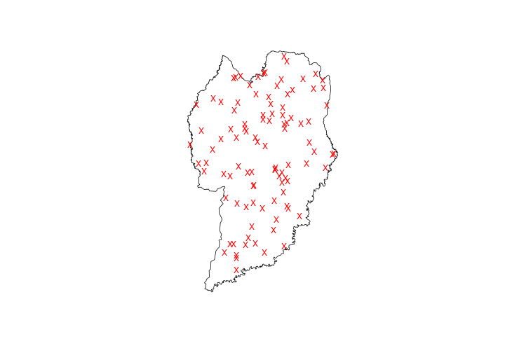

Processo Pontual 
========================================================
- Localização Geográfica - <font color = "red"> Desconhecida </font> à Priori
- A resposta de interesse é onde irá acontecer !

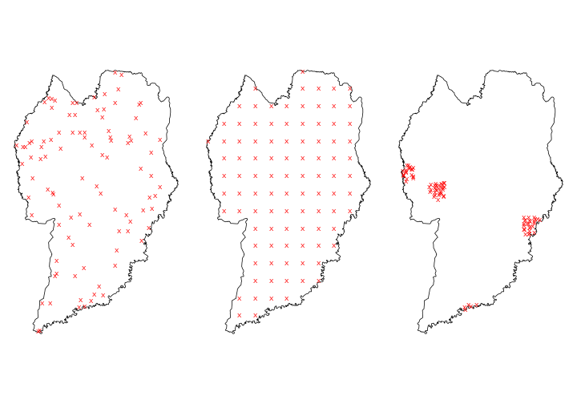

Geoestatística 
========================================================
- Localização Geográfica é <font color="green"> Definida </font> à Priori 
- Quantidade de focos da dengue nas casas

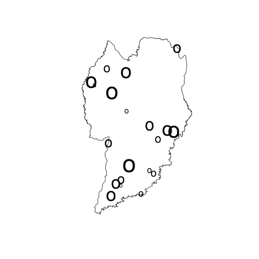

Geoestatística 
========================================================
- Resposta de interesse é: o quanto irá acontecer ! 

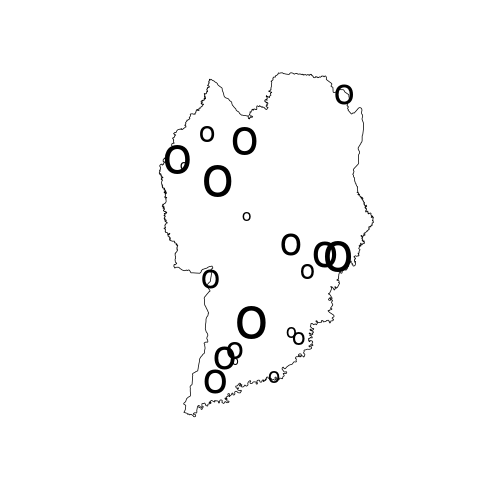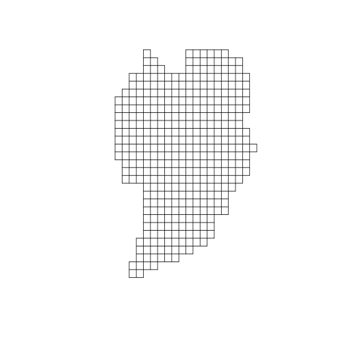

```
[inverse distance weighted interpolation]
```

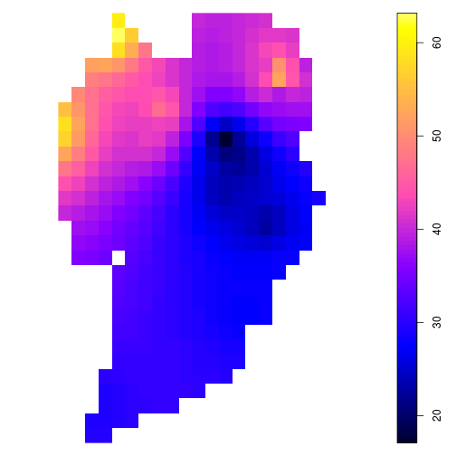

***


Dados de Área
========================================================
- Localização Geográfica é <font color="green"> Definida  </font> à Priori 
- Resposta de Interesse: Quantidade de Focos de Dengue em uma determinada área 

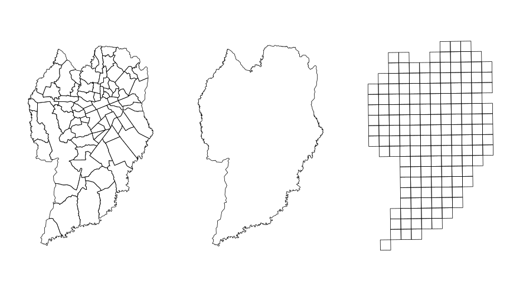

Vizinhança 
========================================================

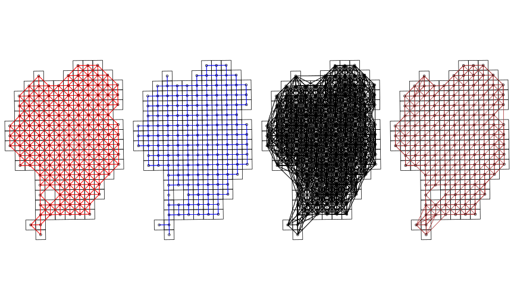


Peso Vizinhança
========================================================
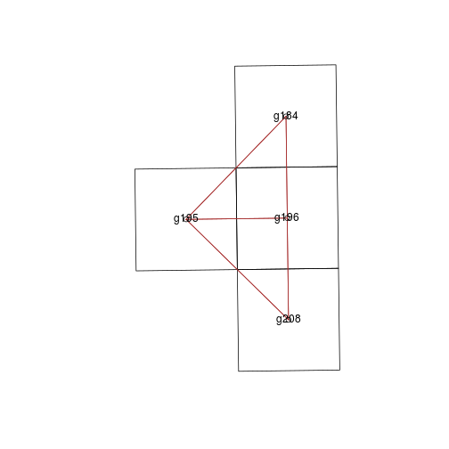

***


|     | g208| g195| g196| g184|
|:----|----:|----:|----:|----:|
|g208 |    0|    1|    1|    0|
|g195 |    1|    0|    1|    1|
|g196 |    1|    1|    0|    1|
|g184 |    0|    1|    1|    0|


|     | g208| g195| g196| g184|
|:----|----:|----:|----:|----:|
|g208 | 0.00| 0.50| 0.50| 0.00|
|g195 | 0.33| 0.00| 0.33| 0.33|
|g196 | 0.33| 0.33| 0.00| 0.33|
|g184 | 0.00| 0.50| 0.50| 0.00|

Aplicação
========================================================
type:section
<!-- Imagem dados  Portal da Prefeitura -->

Objetivo
========================================================
<!-- Imagem dados  Portal da Prefeitura -->
- <font color = "blue"> Identificar áreas com preço de imóveis acima/abaixo dos vizinhos </font>

- <font color = "blue"> Agrupar áreas conforme dos preço de imóveis  </font>
- <font color = "brown"> Identificar fator que possa associar o preço dos imóveis </font>

Base de Dados 
========================================================
type:section


Viva Real
========================================================
title:false


[1] 65253


|   |imovel      |  preco|cobranca      | Area|       m2|       lat|      long|
|:--|:-----------|------:|:-------------|----:|--------:|---------:|---------:|
|1  |Apartamento | 699000|Venda         |  145| 4820.690| -25.46320| -49.28212|
|5  |Sobrado     | 500000|Venda/Aluguel |  110| 4545.455| -25.45159| -49.31597|
|10 |Casa        | 980000|Venda         |  250| 3920.000| -25.37298| -49.33136|

Procedimento
========================================================
left:70%
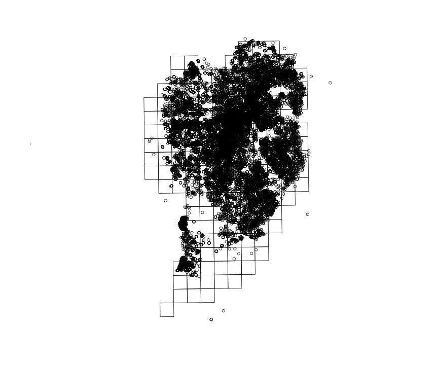

***


|area |       m2|
|:----|--------:|
|g208 | 3439.763|
|g195 | 3041.463|
|g196 | 2978.115|
|g184 | 2951.854|
|g185 | 1944.444|
|g186 | 3968.363|

Mapa do M² Médio por Área
========================================================
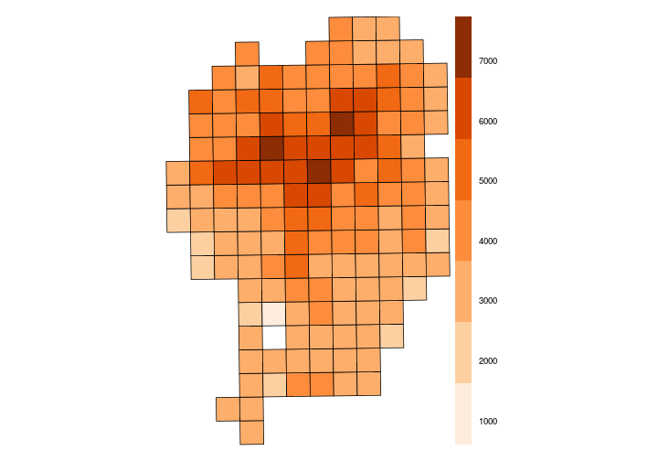

1º Passo
========================================================
type: section

Dependência Espacial
========================================================
- Índice de Moran
- Hipótese Nula - Não Há dependência Espacial
- Hipótese Alternativa - Há dependência Espacial
- Interpretação de Correlação [-1 a 1]

$$ I = \frac{n}{S_0}
\frac{\displaystyle\sum_{i=1}^n \sum_{j=1}^n w_{ij}(x_i - \bar{x})(x_j -
  \bar{x})}{\displaystyle\sum_{i=1}^n (x_i - \bar{x})^2} $$

Diagrama de Dispersão do Moran
========================================================

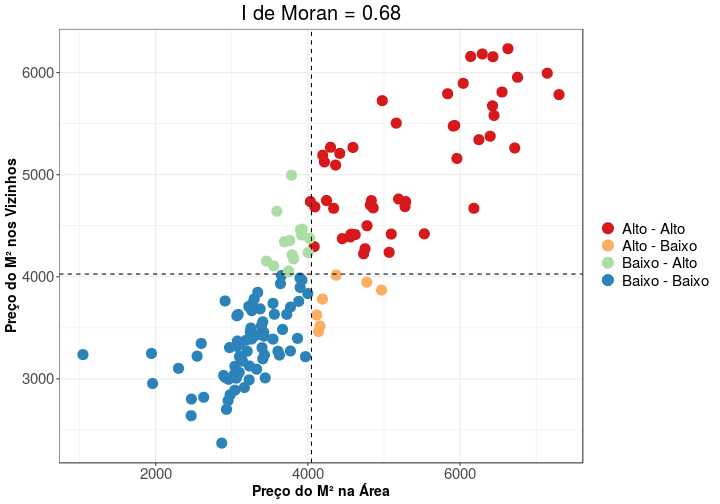

Mapa de Dispersão do Moran
========================================================

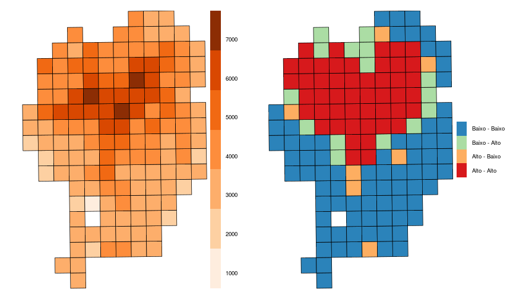


<!-- I de Moran Global -->
<!-- ======================================================== -->

```

	Monte-Carlo simulation of Moran I

data:  cwb_frac$m2 
weights: ponderado  
number of simulations + 1: 1001 

statistic = 0.68866, observed rank = 1001, p-value = 0.000999
alternative hypothesis: greater
```

Estatisticamente Diferente
========================================================
type:section

I de Moran Local
========================================================
+ Hipótese Nula: A área não é diferente dos vizinhos
+ Hipótese Alternativa: A área é diferente do vizinhos (Outliers Locais)
  - Acima
  - Abaixo
  
$$ I_i = \frac{(x_i-\bar{x})}{{∑_{k=1}^{n}(x_k-\bar{x})^2}/(n-1)}{∑_{j=1}^{n}w_{ij}(x_j-\bar{x})} $$


Outliers Locais Acima
========================================================

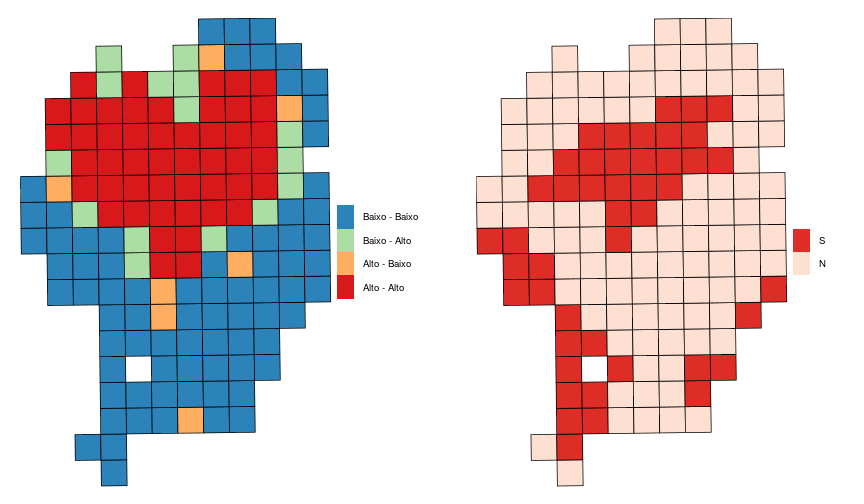


Outliers Locais Abaixo
========================================================

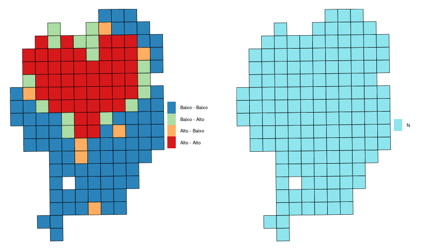

Agrupar Áreas
========================================================
type:section

<!-- Agora vamos pensar em regiões e não apenas áreas --> 

Skater 
======================================================== 
(Cluster Espacial)


Árvore Geradora Mínima
========================================================
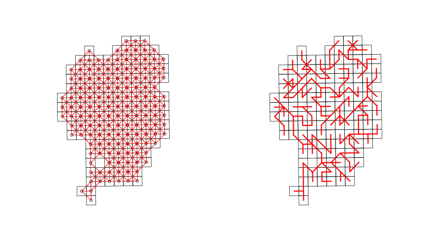

Removendo Arestas
========================================================

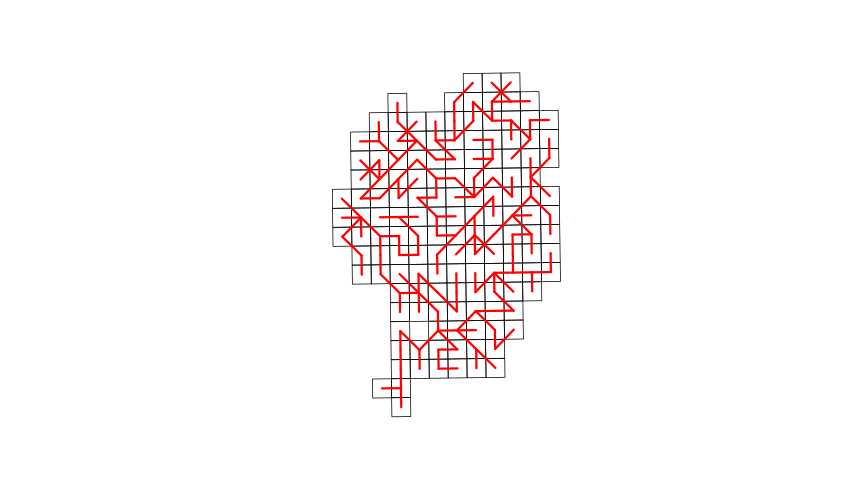

Removendo Arestas - 2 Grupos
========================================================
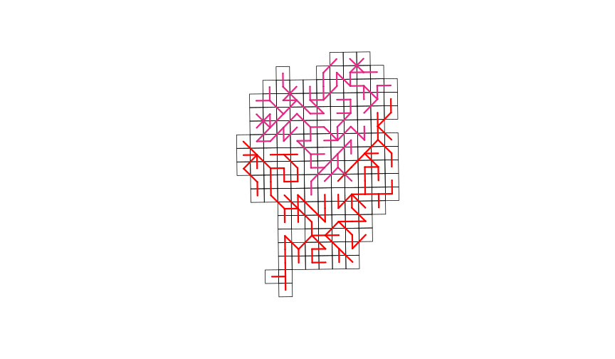


Removendo Arestas - 3 Grupos
========================================================
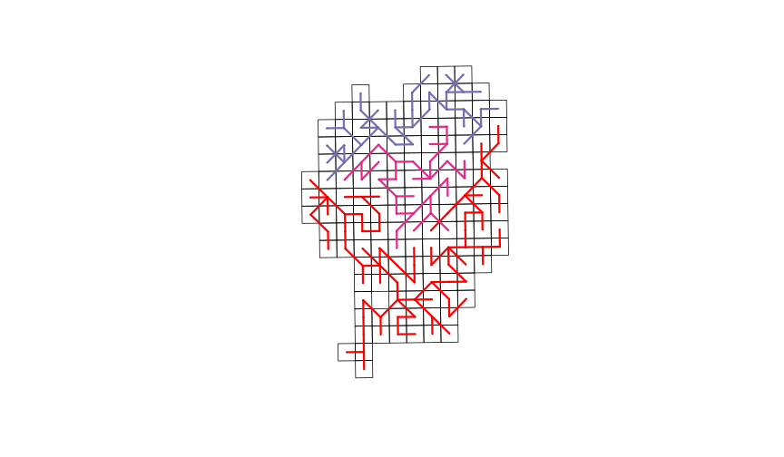

Removendo Arestas - 4 Grupos
========================================================

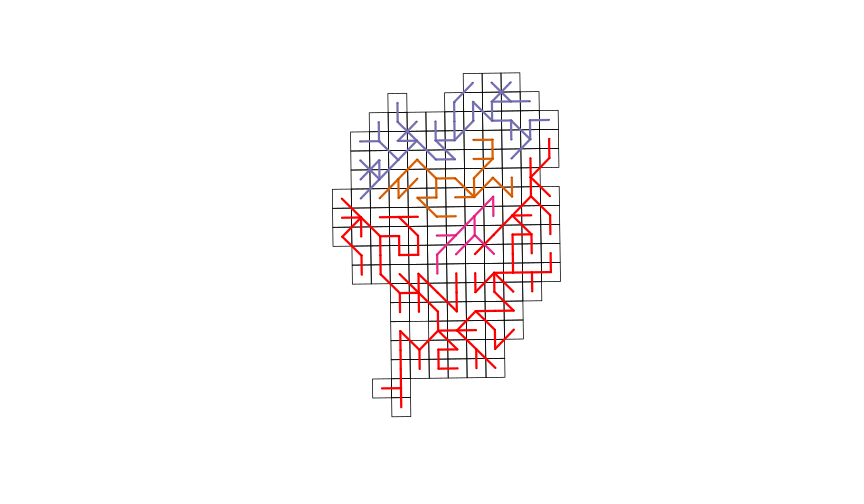

Critério de Poda
========================================================
incremental: true
- Operacional
- Estabilizar o Gráfico de Variabilidade

$$Variação = \sum_{j}^{k} \sum_{j}^{n}(x_{i}- c_{j})^{2}$$

Gráfico da Variabilidade
========================================================
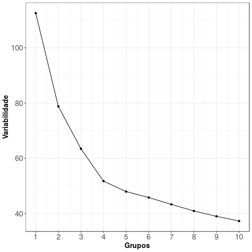


Grupo Ideal 
========================================================
left: 70%

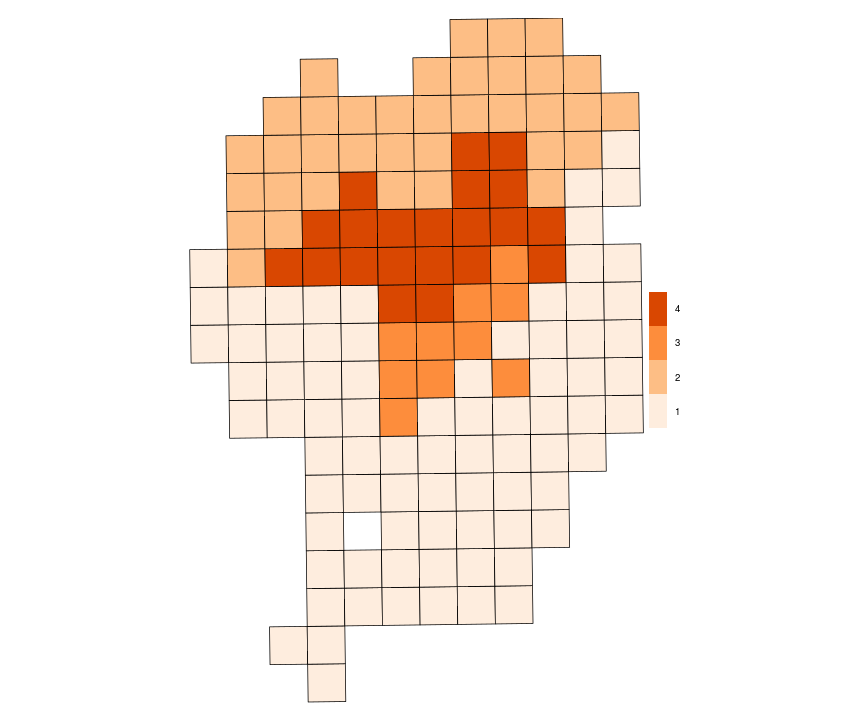

***


|grupo | media_M2|
|:-----|--------:|
|1     | 3275.204|
|2     | 4193.857|
|3     | 4532.843|
|4     | 6292.861|

Identificar Fatores
========================================================
type:section

Variável Associada
========================================================
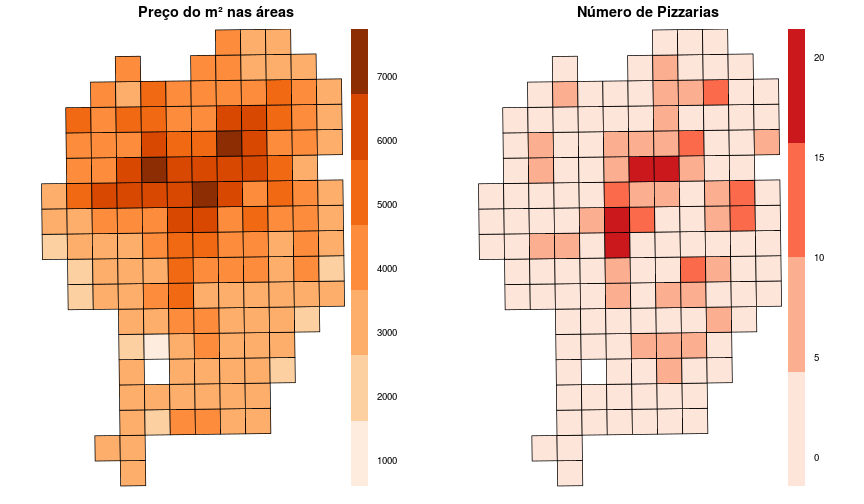

Predição m² sem efeito Espacial
==============================

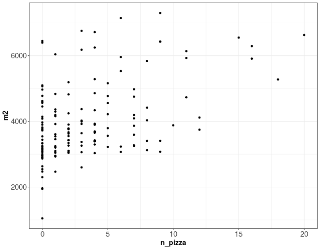


Predição m² sem efeito Espacial
==============================

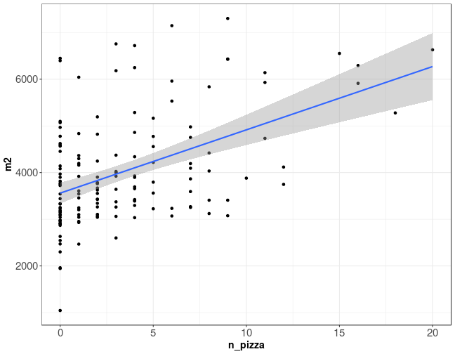


Ajuste de modelo sem Efeito Espacial
================================= 
incremental: true
+ $M^{2}$ = 3558 + $Npizza*135$
+ $R^{2}$ = 23% Variabilidade


```

Call:
lm(formula = m2 ~ n_pizza, data = cwb_frac@data)

Residuals:
    Min      1Q  Median      3Q     Max 
-2513.9  -676.6  -224.7   524.6  2887.4 

Coefficients:
            Estimate Std. Error t value Pr(>|t|)    
(Intercept)  3558.69     113.55  31.339  < 2e-16 ***
n_pizza       135.55      21.35   6.349  2.7e-09 ***
---
Signif. codes:  0 '***' 0.001 '**' 0.01 '*' 0.05 '.' 0.1 ' ' 1

Residual standard error: 1039 on 143 degrees of freedom
Multiple R-squared:  0.2199,	Adjusted R-squared:  0.2144 
F-statistic:  40.3 on 1 and 143 DF,  p-value: 2.705e-09
```


Predição sem Efeito Espacial
=================================             

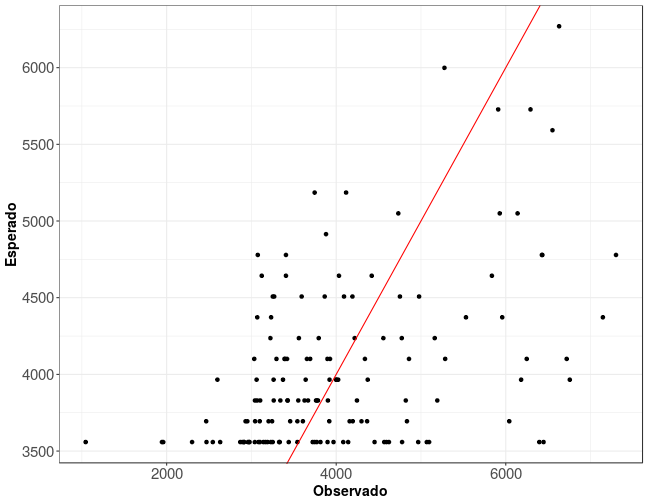

Modelo com Efeito Espacial
=================================
+ $M^{2}$ = $3784$ + $NPizza*22$  +  $\lambda$ (0.8) $W_{ij}$ (y_${i}$)
+ $R^{2}$ = 74% Variabilidade


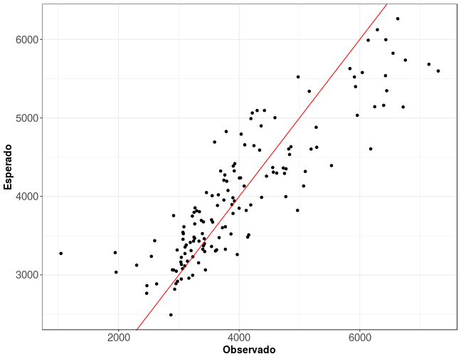

Próximo Passos
=================================
+ Adicionar variáveis de Qualidade de Vida
+ Adicionar variáveis de Empreendimento

Obrigado
=================================
type:section
